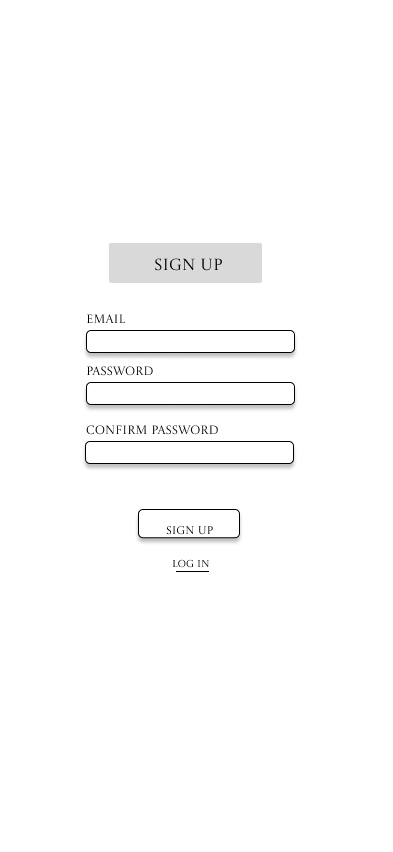
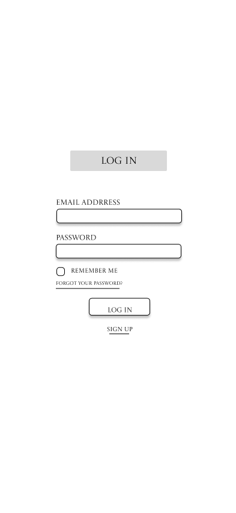
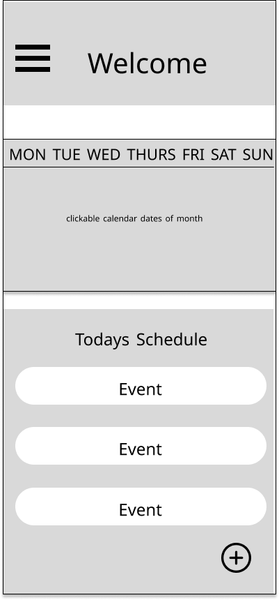
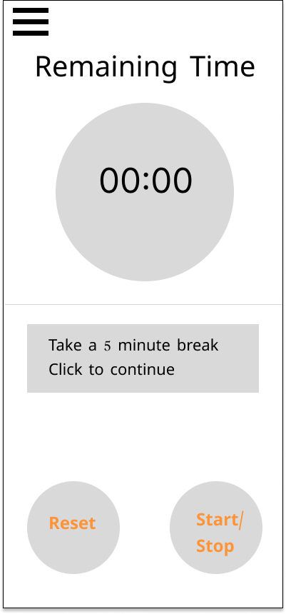
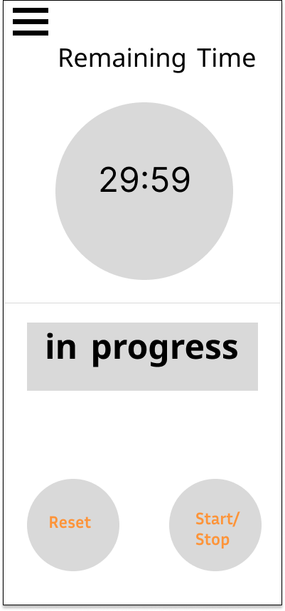
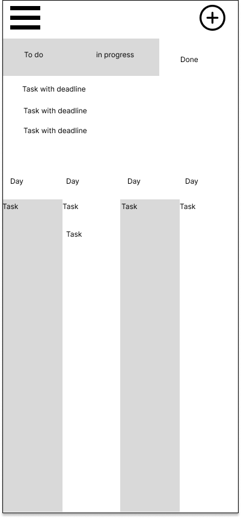
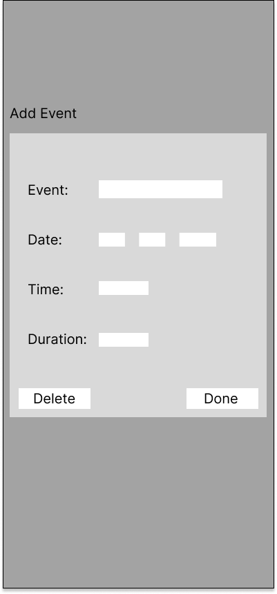
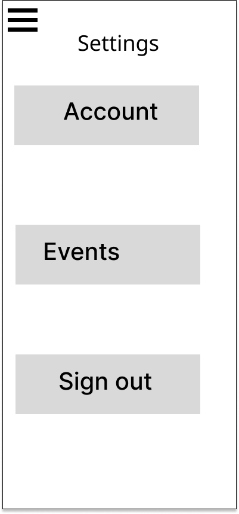

# User Experience Design

## Prototype Source File
[Prototype] (https://www.figma.com/design/yhpELfMcuqBpfHDF8v8Koc/Flipped-2-wireframe?m=auto&t=u57S4FEAzsSulzcf-6)

## App Map

## Wireframes

### Welcome

- Welcome page when you open the app.

### Sign Up

- Sign up diagram allows users to register for an account.

### Log In

- Log in diagram allows users to log in to the app.

### Home

- Home page with the calendar and list of events for the day

### Timer

- Flip feature for time and focused work, with diagrams for paused, in progress and the tarot reward

### To Do
 

- To Do List with all tasks that need to be done.

### Add Form

- Add Event popup to add event to calendar

### Edit Form

- Edit event form to edit or delete event from calendar/

### Sidebar

- Sidebar diagram for sidebar to navigate between features

### Settings

- Settings page to edit app features, with edit to account diagram and event diagram